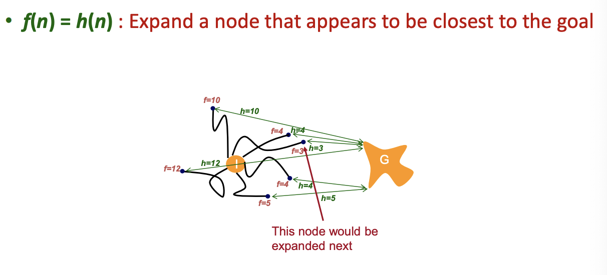
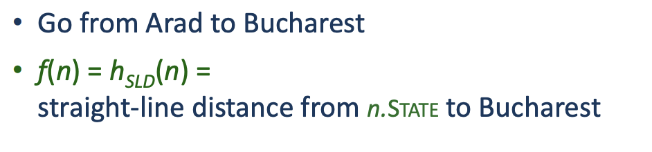
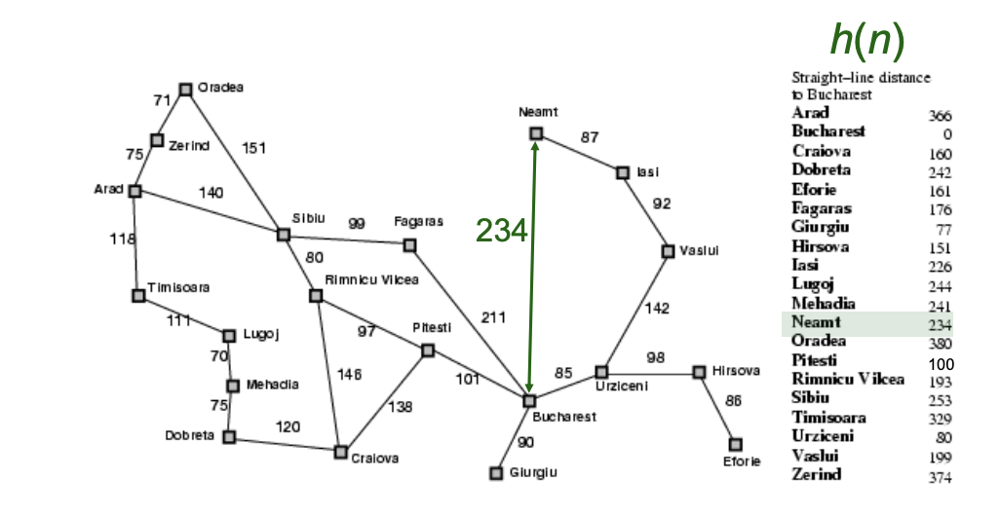
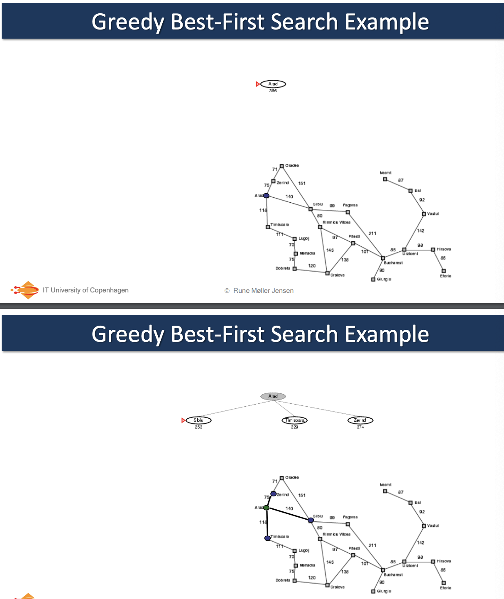
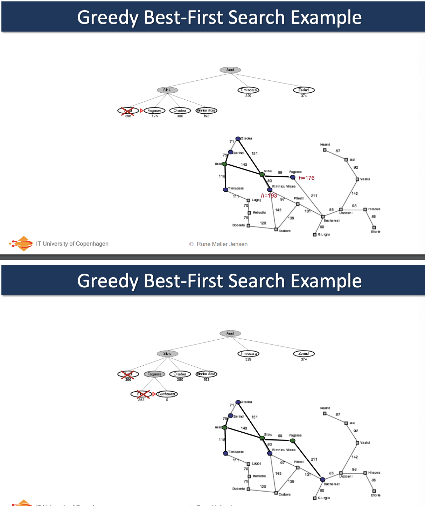
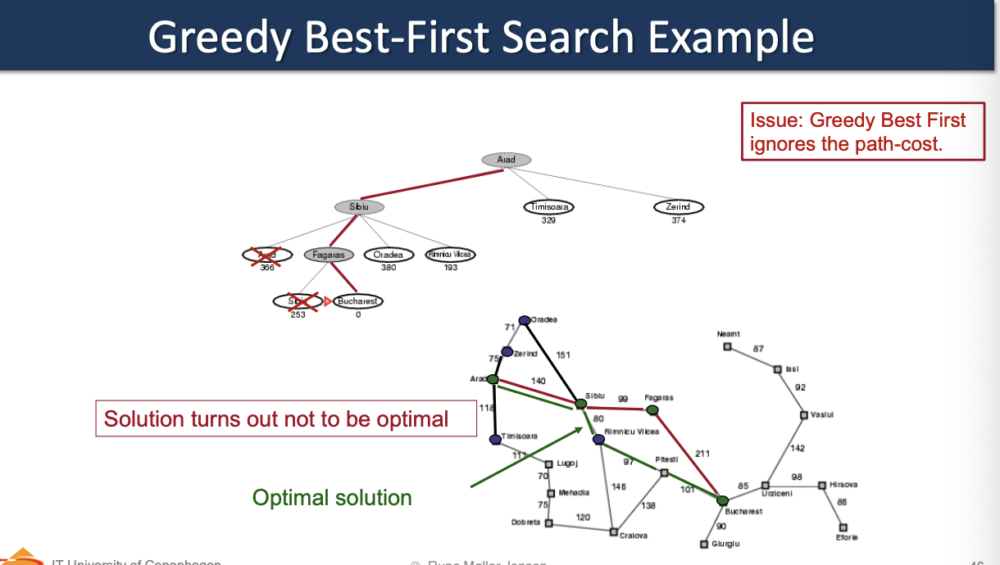

**Note:** this could look alike [[algorithms.search.informedSearch.aStar]]. However the difference is that A* includes the cost of reaching the node.

This algorithm tries to expand the node that is the closest to the goal. It does so, because it thinks that it is likely to lead to a solution quickly. 

This algorithm ignores the previous cost of the path. It only cares which next node is the closest.

It uses a heuristic function to determine the node which is closest:

$f(n)=h(n)$

This is complet because it does not ignore other nodes.

# Algorithm

# Example from the book

