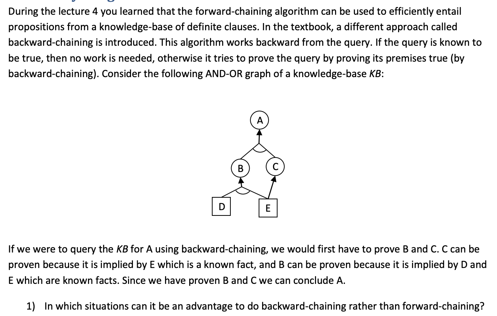
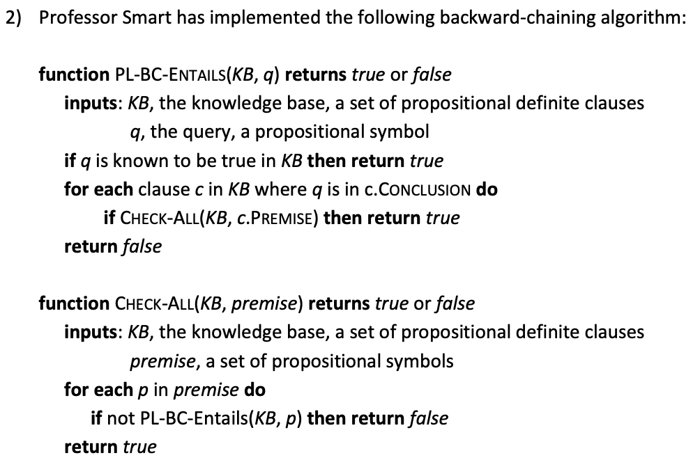
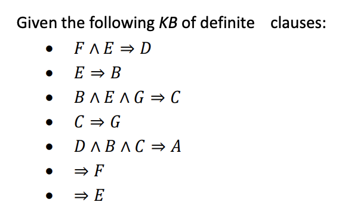
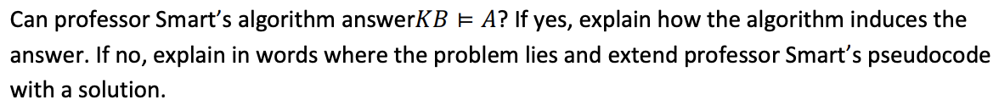
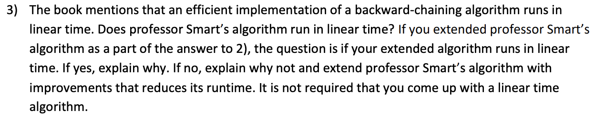

# Mandatory Assignment

### Question 1


#### Answer
According to the book, then *Backward chaining* starts from the query $q$ and goes "down" the knowledge base until it is either proved or not. *Backward chaining* provides a depth-first search. It only uses the sentences that it requires and can in optimal situations find literals that proves that $q$ is true early.

With the *Forward chaining* you have to go through all of the models in the knowledge base with breath first search in order to prove the sentence.

### Question 2






#### Answer
The answer is **no**. The reason is that it goes into an infinite loop when it wants to prove $C$. In order to prove $C$, it then needs to prove $B \land E \land G$ and in order to prove $G$ you need to prove $C$. Clearly this will never stop. 
For that reason it will not entail $A$.

**Extension of pseudocode**

So in order to extend the algorithm, we need to figure out a way to find out if we are in the process of proving a literal. If we are then we need to return `false` else we have to add the literal to our set and continue with out proof. When the literal has been proved then we can remove it from the set, guaranteeing that we do not run in to infinite loops. 

```
function PL-BC-ENTAILS(KB, q) returns true or false
    inputs: KB, the knowledge base, a set of propositional definite clauses
            q, the query, a propositional symbol
        
    ls ← new Set

    return PL-BC-ENTAILS-REC(KB, ls, q)
```
```
function PL-BC-ENTAILS-REC(KB, ls, q)
    inputs: KB, the knowledge base, a set of propositional definite clauses
            q, the query, a propositional symbol
            ls, a set of literals that needs to being proved
        
    if q is known to be true in KB 
        then return true
        
    for each clause c in KB where q is in c.CONCLUSION do
        if CHECK-ALL(KB, ls, c.PREMISE) then return true
        
    return false
```
```
function CHECK-ALL(KB, ls, premise) returns true or false
    inputs: KB, the knowledge base, a set of propositional definite clauses
            ls, the set containing the literals being proved
            premise, a set of propositional symbols

    for each p in premise do
    
        if ls.contains(p) then
            return false
        else 
            ls.add(p)
            
        if not PL-BC-Entails-REC(KB, ls, p) then 
            return false
    
        ls.Remove(p)    
    
    return true
```

### Question 3


#### Answer
To answer the first part. No Smart's algorithm does not run in linear time. The issue with his algorithm is that it can revisit premises, hence trying to prove them again.
And the extension above does not change that. It only ensures that it does not run in an infinite loop. 

In order to make it linear we could potentially create a map containing the literal as a key and associate it with a true if it has been proved or false if it has not been proved yet. 

**Example of a new implementation**
```
function PL-BC-ENTAILS(KB, q) returns true or false
    inputs: KB, the knowledge base, a set of propositional definite clauses
            q, the query, a propositional symbol
        
    ls ← new Map<literal, boolean>

    return PL-BC-ENTAILS-REC(KB, ls, q)
```
```
function PL-BC-ENTAILS-REC(KB, ls, q)
    inputs: KB, the knowledge base, a set of propositional definite clauses
            q, the query, a propositional symbol
            ls, a map of literals that indicates if it has been proved or not
        
    if q is known to be true in KB then 
        return true
        
    for each clause c in KB where q is in c.CONCLUSION do
    
        if CHECK-ALL(KB, ls, c.PREMISE) then 
            return true
        
    return false
```
```
function CHECK-ALL(KB, ls, premise) returns true or false
    inputs: KB, the knowledge base, a set of propositional definite clauses
            ls, a map of literals that indicates if it has been proved or not
            premise, a set of propositional symbols
            
    for each p in premise do
    
        if ls.containsKey(p) then
            if ls.getValue(p) == false then
                return false
        else 
            ls.add(p, false)
        
        if not PL-BC-Entails-REC(KB, ls, p) then 
            return false
    
        ls.change(p, true)    
    
    return true
```