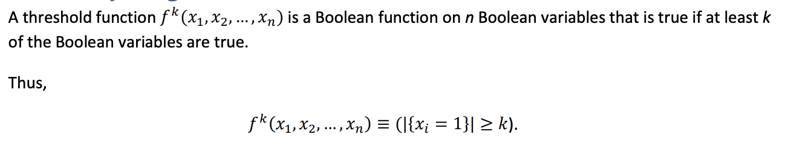
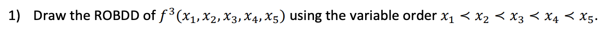
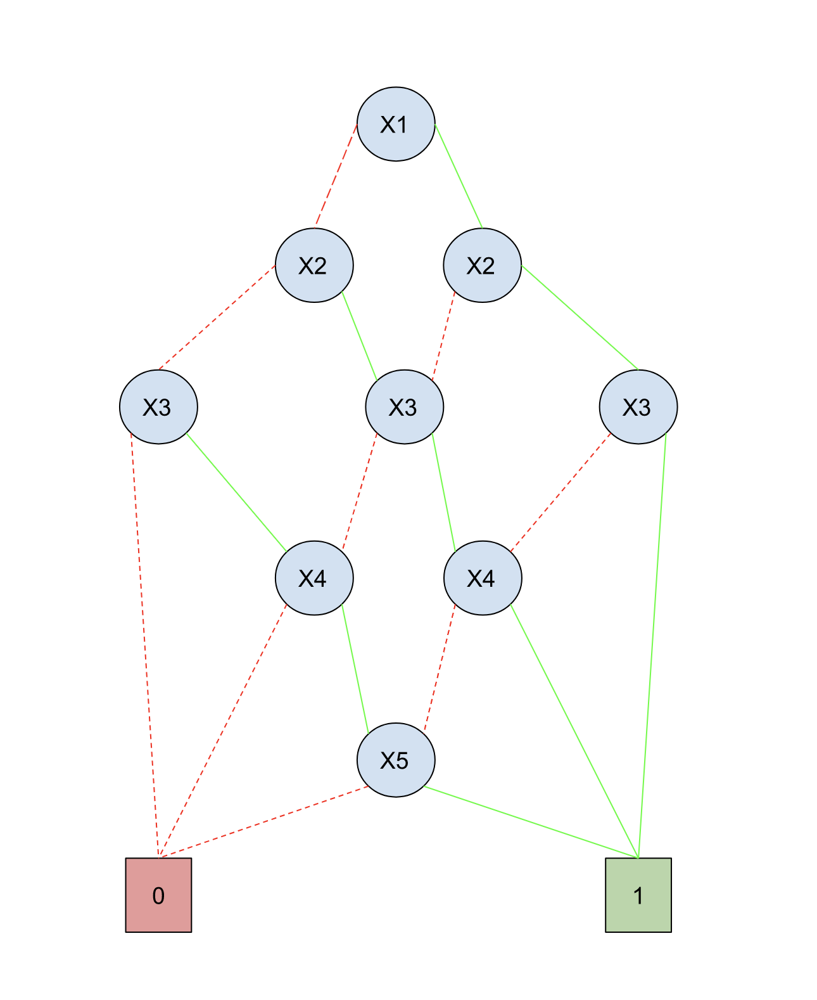
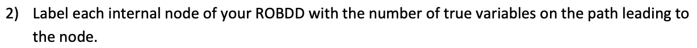
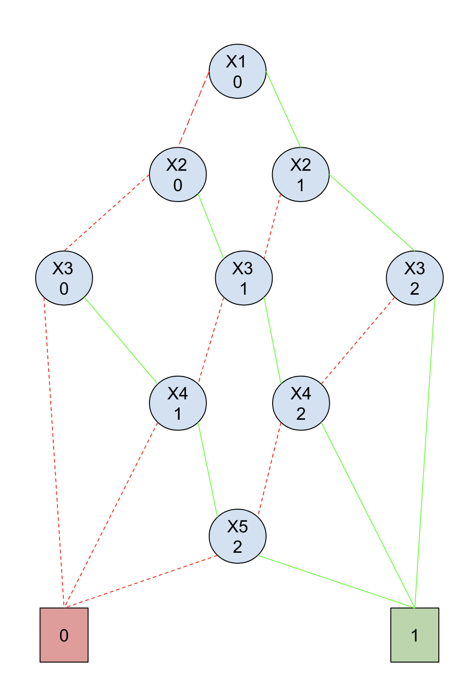
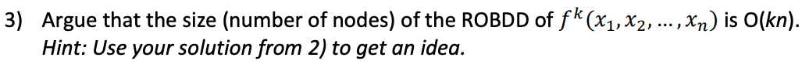
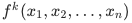

# Question 1

#### Answer

# Question 2

#### Answer

# Question 3

#### Answer 
The ROBDD of:

 

is O(kn) because at the k level, the number of nodes for the specific variable does not exceed k. And when there is k levels back then the amount of variables decreases again. After that we can plus with 2 because of the two terminal nodes(i.e. 1 and 0). 

So to sum up, O(kn) 
holds because every level of the ROBDD does not contain n nodes and at no point does it exceed k nodes for a given variable.

