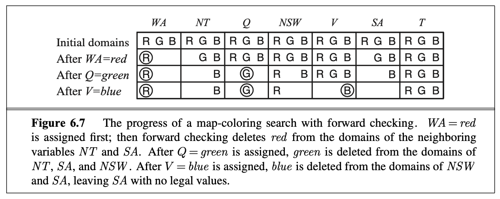
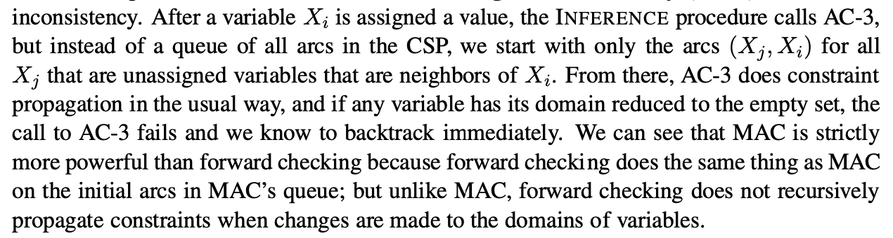
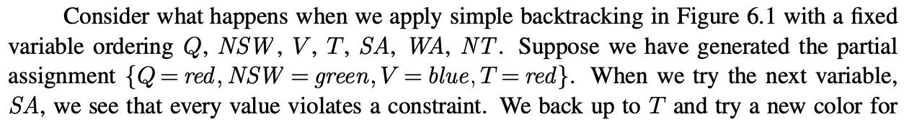
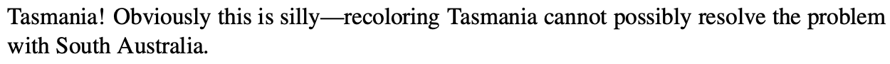

We have seen how *AC-3* and other algorithms has reduced the domain of variables before we begin the search. 

This can also be possible with inference. Inference can actually be more powerful when it comes to search.

> **When we use inference:**
>
> "every time we make a choice of a value for a variable, we have a brand-new opportunity to infer new domain reductions on the neighboring variables" - Book RN (old version), page 217

# Forward Checking
This is the simplest form of inference. Every time variable $X$ is assigned, the forward checking process tries to make an *arc consistency* for it. However, for each unassigned variable $Y$, that is connected to $X$ by some kind of a constraint, deletes from $Y$'s domain any value that is not consistent with the value chosen for $X$.

Here is an example of how to do backtracking search with forward checking. 

However, forward checking does not catch all inconsistencies. The reason for this, is that it makes the current variable arc consistent, but does not do the look ahead in order to make all other variables arc-consistent. 

But there is, of course, an algorithm to solve this. It is called ** (Maintaining Arc Consistency)**. It detects the inconsistencies. It does so by doing to following:

# Backtracking: Looking Backward
**Backtracking-Search** algorithm contains a very simple procedure when a branch of the search fails. It backs up to the proceeding variable and try a different value for it, also called *Chronological backtracking*. 

An example on what this exactly does comes here:

There are different methods in order to do the backtracking.

### Backjumping 
Is the method that backtracks to the most recent assignment in the conflict set. 

A *conflict set* is the set that keeps track of a set og assignments that are in conflict with some value of a variable.