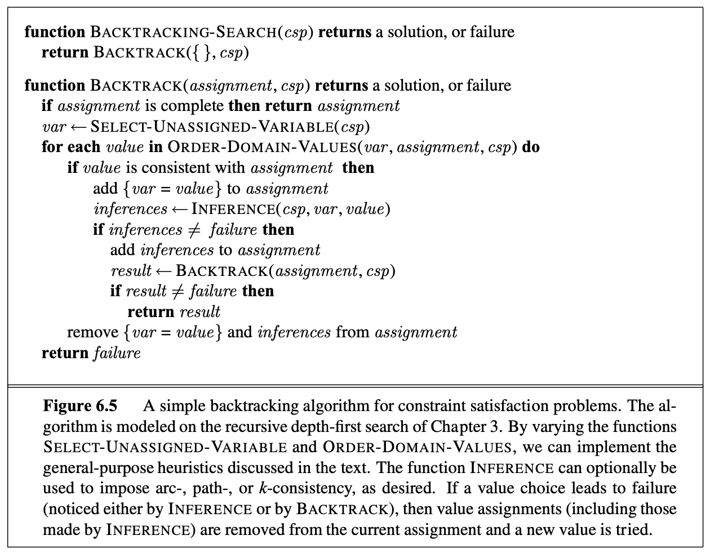
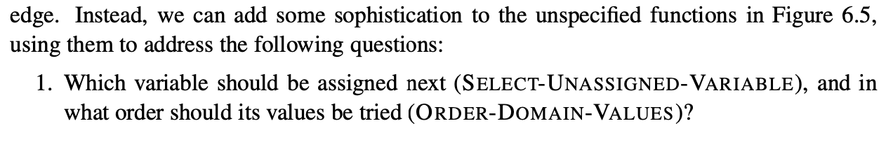
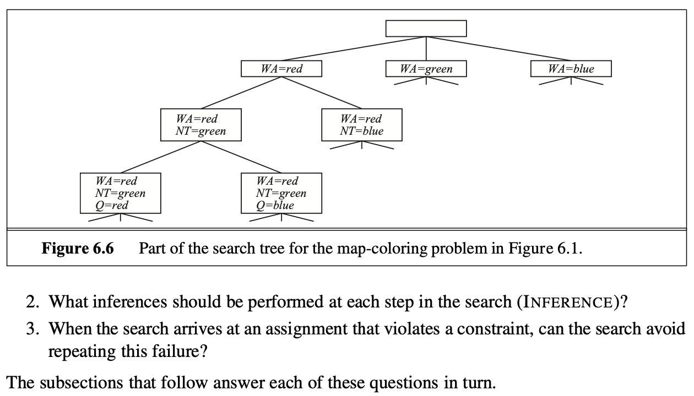

This is an algorithm that works for partial assignments([[books.RN.Chapter5.definingConstraintSatisfactionProblems]]). 

With this algorithm we notice that we want to remove where values assigned to variables reach the same partial assignment regardless of the order.

There some options in order to get the best heuristic for choosing the next variable i.e. the logic for `SELECT-UNASSIGNED-VARIABLE`.
In [[books.RN.Chapter5.backTrackingSearch.variableAndValueOrdering]] you can choose between three options. According to a previous exam attempt then the MRV heuristic is normally stronger than the degree heuristic.

#### Algorithm

This is an algorithm that uses the Depth-first search. This algorithm repeatedly chooses an unassigned variable, and then tries all values in the domain of that variable in turn, trying to find a solution.

We have before added heuristics in order to improve the performance of the algorithm. It turns out that we do not need to here:

