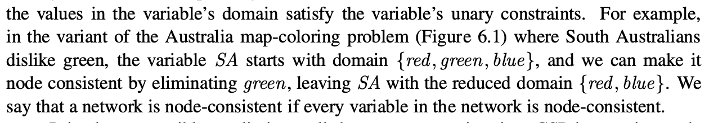

What is the goal with it:

State space search in a regular search algorithm can do only one thing, and that is to search. However, in a CSP there is a choice: You can either search or do a specific type of inference which is called **constraint propagation**.

Constraint propagation is when you use the constraints to reduce the number of legal values for a variable. 

The key thing is **Local Consistency**. That is, if we treat each variable as a node in a graph and each binary constraint as an arc, then the process of enforcing local consistency in each part of the graph causes inconsistent values to be eliminated. 

# Node Consistency
Node consistency is if a variable (which is a node in the CSP network), if all the values in the variables domain satisfy its(i.e. variable) unary constraint.

So for example:

# Arc Consistency
The variable is arc-consistent if every value in its domain satisfies the variables binary constraints. 

### Example

### Arc consistency algorithm

#### Complexity 

# Global Constraints
A Global constraint is one involving an arbitrary number of variabels. Constraint propagation is stronger for Global constraints then constraint propagation for its binary representation.