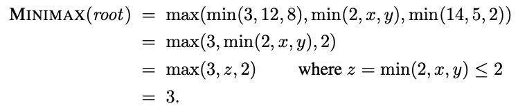
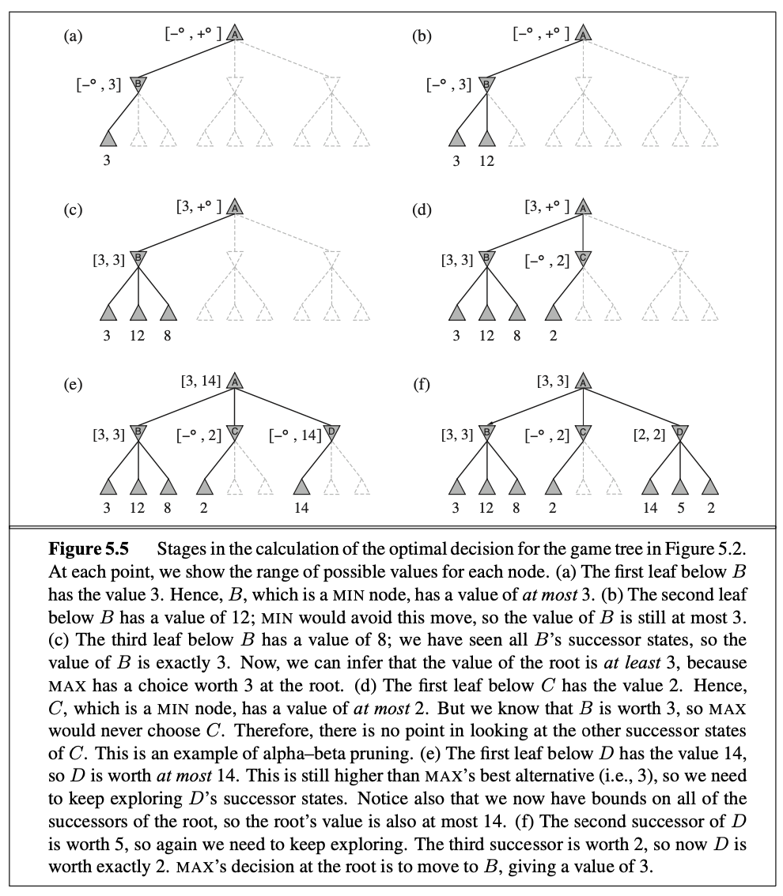
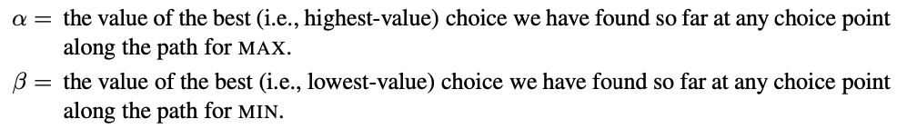
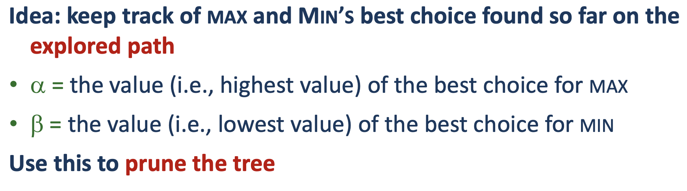
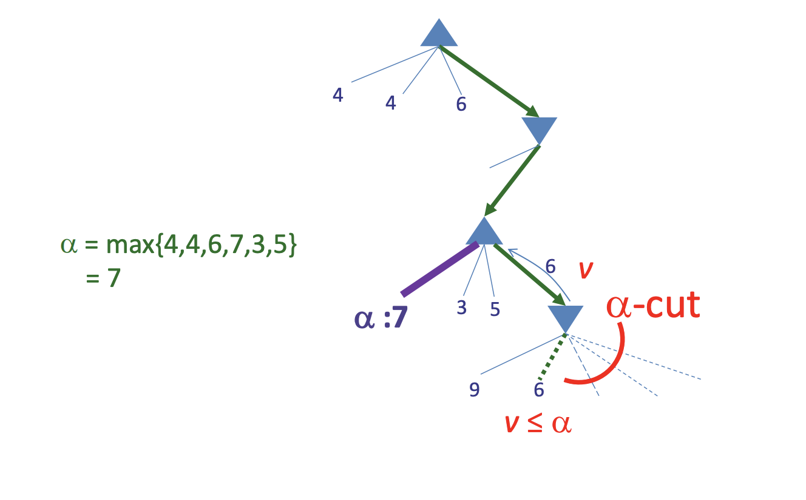
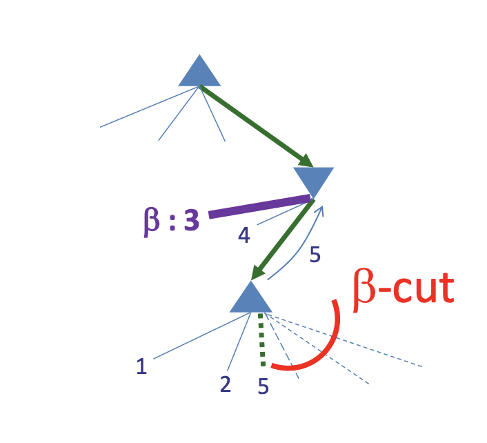
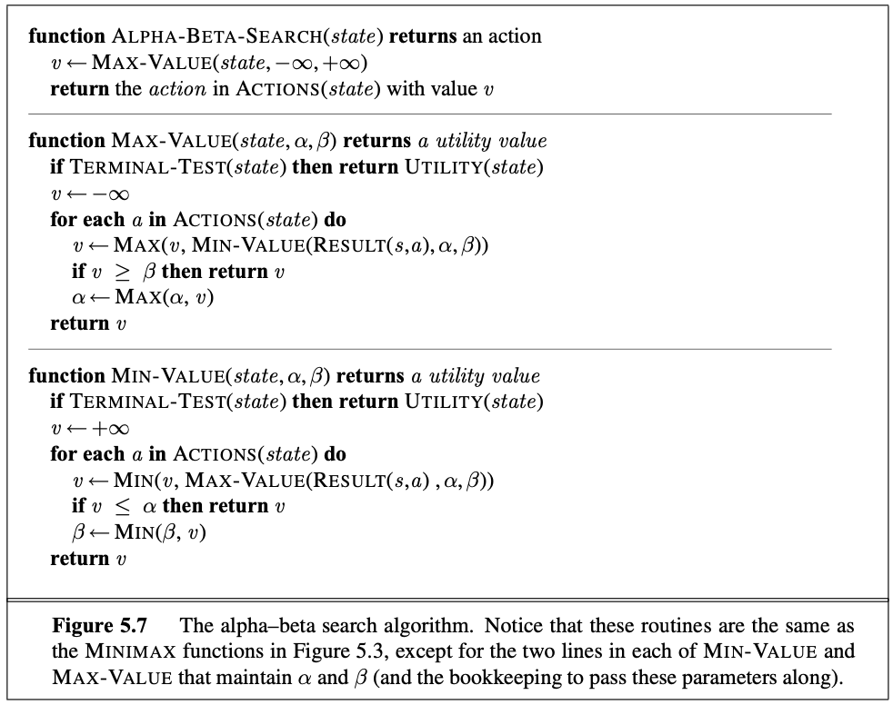
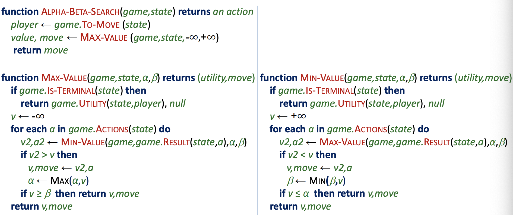
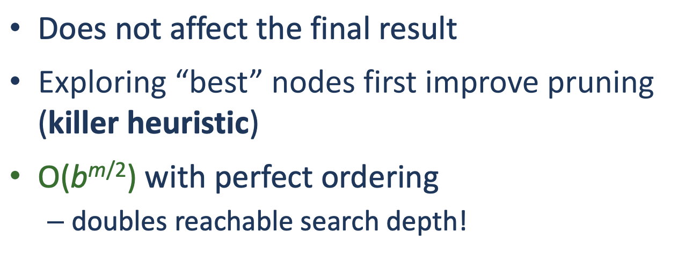

The biggest problem with [[algorithms.search.games.miniMax]] is that it has to examine exponential in the depth of the tree.

We cannot eliminate the exponential element of the time-complexity, but we can cut the exponent in half. We borrow the idea of **pruning**, in that way we do not need to look at every branch in the tree. 

Alpha-Beta pruning get its name by the following:

#### From the lecture

It is important to notice here that the cut happens for different reasons. So the alpha cut happens for the perspective of us (i.e. MAX) where we want to best choice. 
The beta cut is the value with lowest value. That is the best choice for MIN.

So in order to add some context then the alpha cut happens in the *MIN-Value* function when it can see that the value in the MIN-Value function is less than the Alpha value. Because then we wont take that route because then MIN could potentially take a route where we get less for winning.

And the other way around the beta cut happens in *MAX-Value* function where it cuts when it sees the result is greater than the current beta. Because then we know(i.e. MAX even though it is for MIN) that MIN will not choose this path and for that reason it does not make sense to continue

The alpha cut:

The beta cut: 

## Implementation

#### Implementation from the lecture

## Move ordering
The effectiveness of alpha-beta pruning is highly dependent of the order in which the states are examined. 

If we can examine the first successor then the time complexity of the minimax becomes $O(b^{m/2})$.

