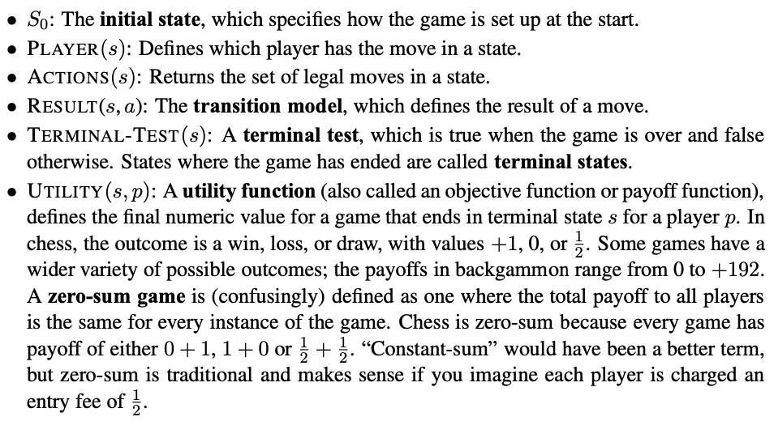
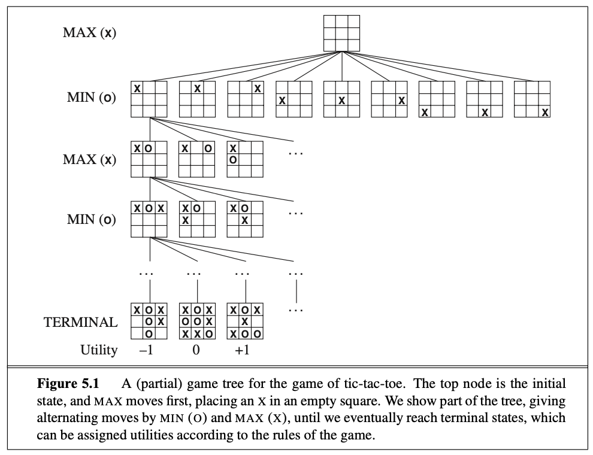

In this book we cover what is called competitive environments, in which the agents goals are in conflict. This gives rise to **adversarial search** problems also known as games.

What we specifically cover now is the problems that game theorists call deterministic, turn-taking, two-player, zero-sum games[^1] of perfect information (e.g. chess). In other words... deterministic, fully-observable environments in which two agents act alternately and in which the utility values at the end of the game are always equal and oposite. 

A game can be defined as a search problem with the following elements:

Here is an example of how a tree for the tic-tac-toe game would look like with the players *Min* and *Max*.

>**Note:** the name of the players is not by coincidence the *Min* player looks for possibilities where the end goal is `-1` and the *Max* player looks for possibilities where the end goal is `+1`. 

---
[^1]A zero sum game is defined as on where the total payoff to all players is the same for every instance of the game.