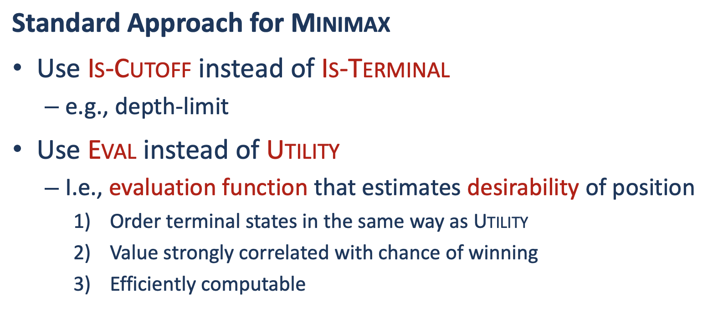
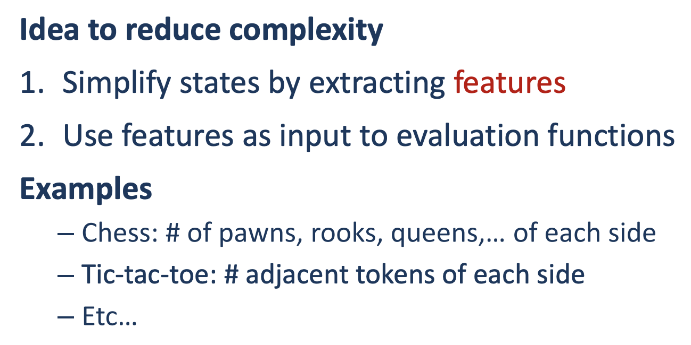
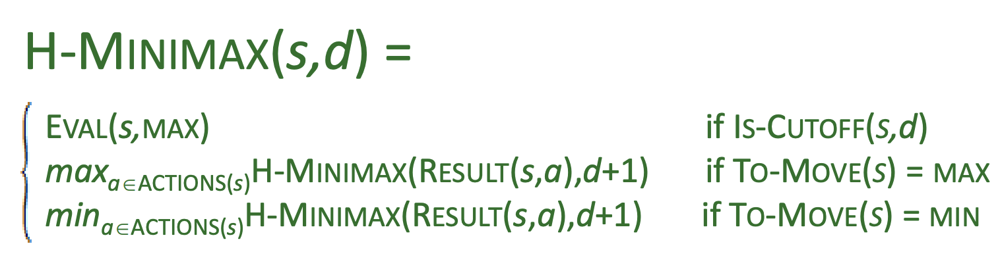
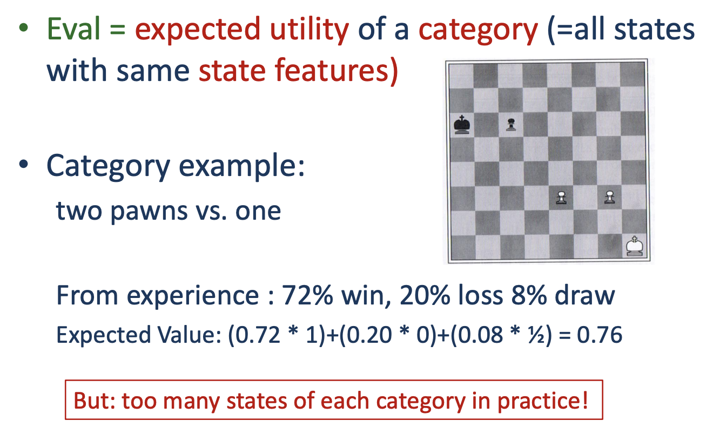
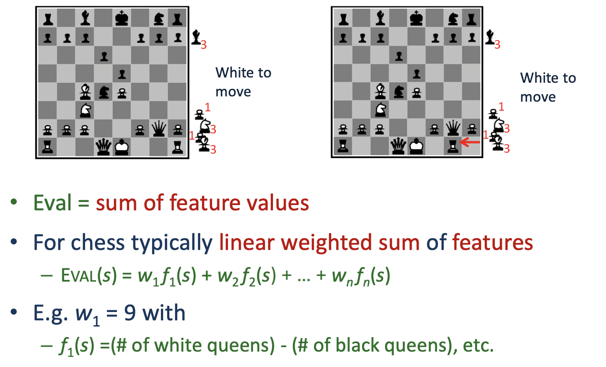
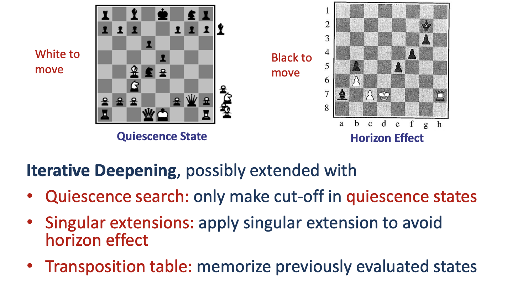
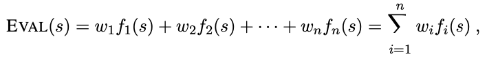
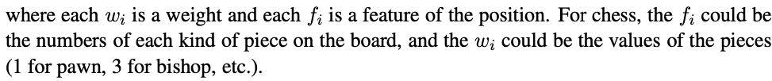
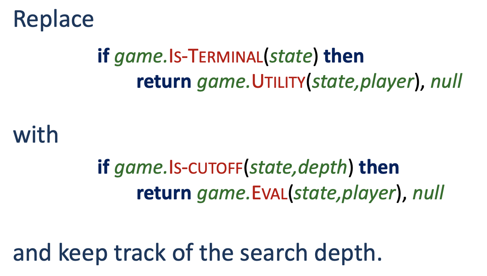
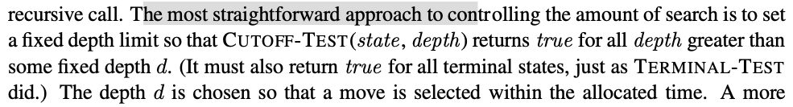

The minimax algorithm generates the entire game search space. And the beta-alpha version of the algorithm still has to search all the way to the terminal states for a smaller portion of the search space. 

The issue with [[books.RN.Chapter6.alphaBetaPruning]] is that we still need to look up a lot of the nodes/states in the tree.

The compution in the length of the depth every times is not optimal. We should instead apply a heuristic to the search so that we cut of the search.




We do so by replacing the `utility` function with a heuristic evaluation function called `Eval`.


# Evaluation functions
The evaluation function returns an estimate of the expected utility function of the game from a given position. 

This function guesses, so to speak, what the outcome could be.

In order to calculate the "score" we first define weights to the different elements. In chess this could be the different pieces(e.g. pawn = 1, bishop = 3, rook = 5, queen = 9). Features could be the postion of the pawn.

#### From the lecture




This kind of evaluation function is called a Weighted linear function becuase it can be expressed as:




# Cutting off search
Now we implement the heuristic in the [[books.RN.Chapter6.alphaBetaPruning]]. We replace the two lines in the pseudo code that mention `Terminal-Test` with the following line:
```
if CUTOFF-TEST(state, depth) then return Eval(state)
```


Also we must bookkeep the current depth so that on each recursive call it gets incremented. 


# Forward pruning
In forward pruning we look ahead of certain moves in order to be more certain that the moves are correct. But we do not want to do this for all the moves possible. For that reason we only look at the n best possible moves instead of all possible moves. This is called **beam search**.

However this is a dangerous algorithm because there is no guarantee that the best move will not be pruned away.

# Search vs. lookup
In the past experience both at the start of a game and at the end of a game it is a good idea to have a table lookup. We can here rely on the statistics of good openings. After that we rely on search until we reach near the end of the game. 
