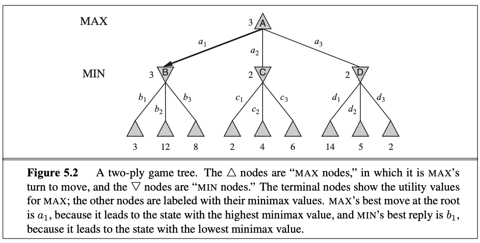
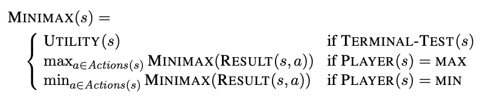
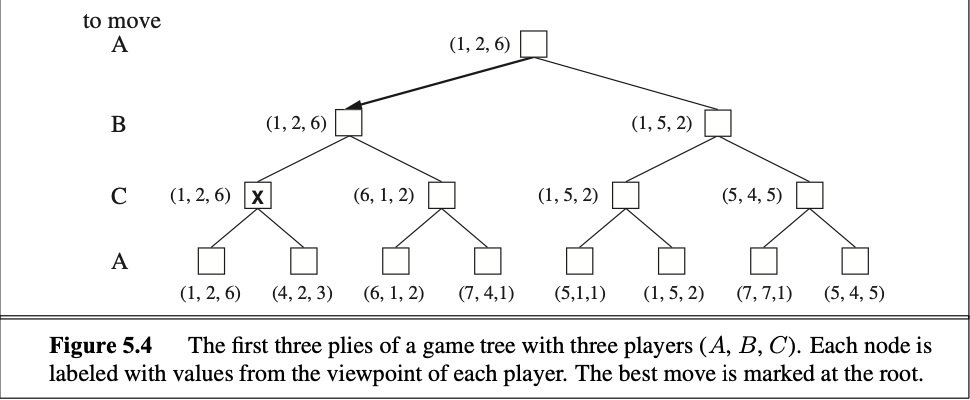

In the normal search problem from [[lectures.lecture2.searchProblemDefinition]], the solution was the best path to the goal state. However this is not the case here where the other player wants to win as well. 

There the AI you develop for this particular problem must have a strategy.

As far as I understand is that the AI should anticipate every move that can be made by the opponent and counter them.

In order for the players to choose the actions that they would prefer then we create the following function:

## Minimax algorithm
[[algorithms.search.games.miniMax]]

## Optimal decisions in multiplayer games
Instead of having a single value then we need to expand for a vector of values that corresponds to each player $<v_a, v_b, v_c>$.

>**Note:** that here at the marked node the player `C have to choose which move it wants to make. For that reason it 

You can also reach a state where the vector looks like this 

$<10, 200, 200>$

Here player $b$ and player $c$ have the same terminal values. It can be that the will both work together in order to reach this state if that is what gives them the highest state. 