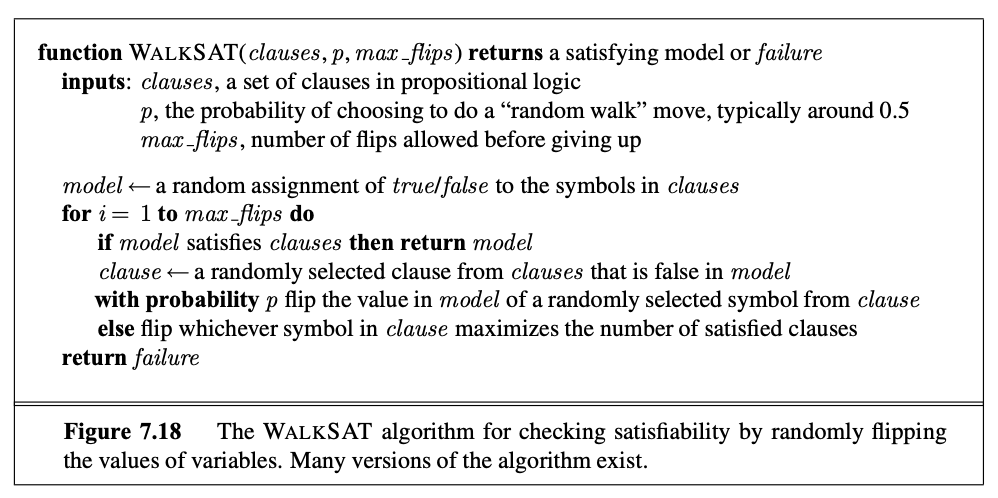

In this section the book describes a section about two efficient algorithms about the inference part of the propsitional logic. 

The algorithms we cover here is for checking satisfiability: the SAT problem. 

# Davis-Putnam algorithm
[[algorithms.logic.propositionalLogic.davisPutnam]]

# Walk SAT algorithm
