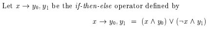
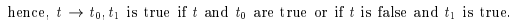
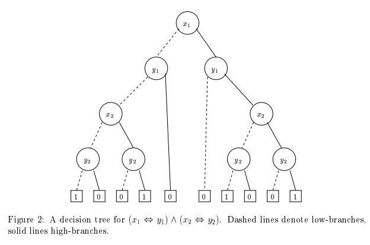
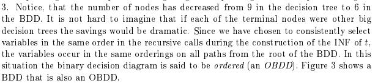
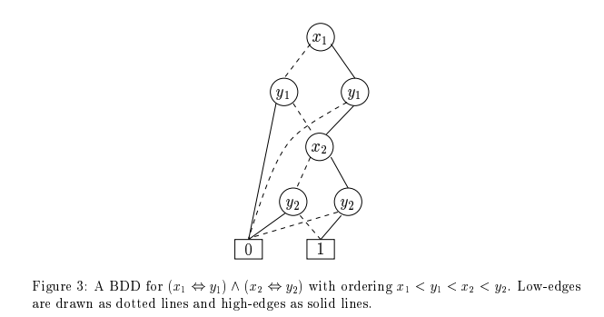
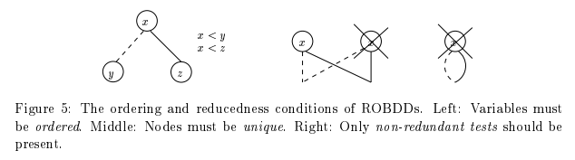
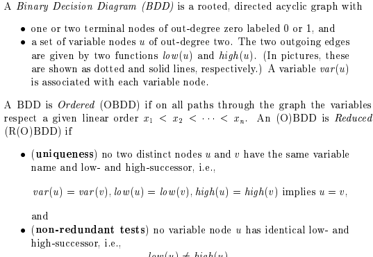

It is first important to note the following for the if-then-else operator:

We call $t$ for the *test expression*.

This gives us a new normal form called [[If-then-else Normal Form (INF)|books.a97.normalForms#if-then-else-normal-form-inf]].

# Bindary decision diagram (BDD)
*OBDD = Ordered Binary Decision Diagram*

Here is an example of a BDD:

Notice the difference between the figure 2 and figure 3. The amount of nodes has been reduced from 9 to 6.

If all identitical nodes are shared and all redundant tests are eliminated then the OBDD is said to be reduced i.e. ROBDD.

ROBDD has a convenient lemma around a property called canonicity:

