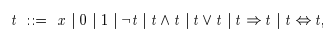

Boolean expressions is a classical way of dealing with truth values. It consists of Boolean variables(e.g. $x$, $y$), the constants $true$ and $false$. the operations of conjunction(i.e. *and*), disjunction (i.e. *or*), negation(i.e. *not*), implication and bi-implication. Together they all form a boolean expression.

Sometimes variables are called *proposition variables* or *propositional letters* and the boolean expressions are then known as [[books.RN.Chapter7.propositionalLogic]].

Here is the grammar:

