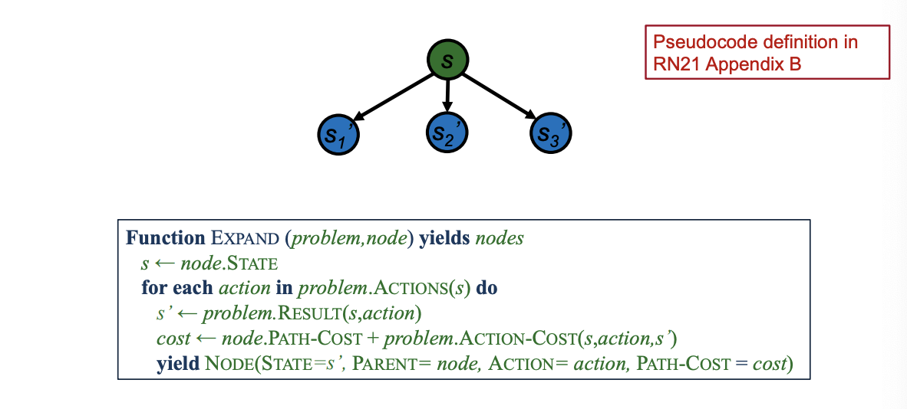

Expand function is the function that generates new Search Nodes.

For each action that is applicable on a state $s$ it generates a new state $s´$(search node).
Also it calculates the cost for each new node.