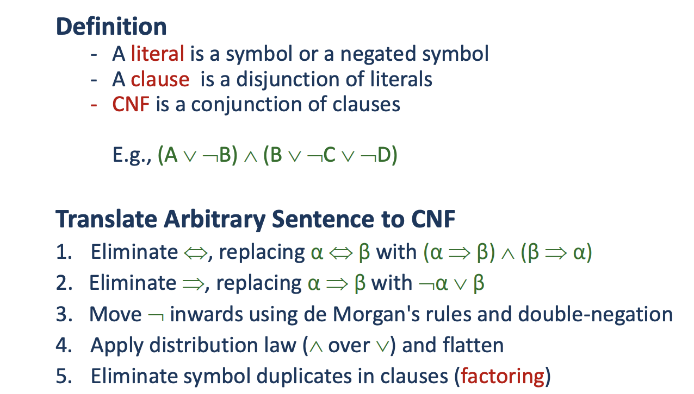
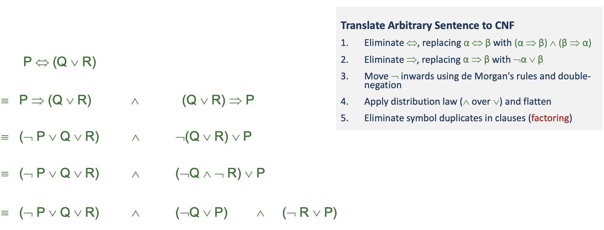
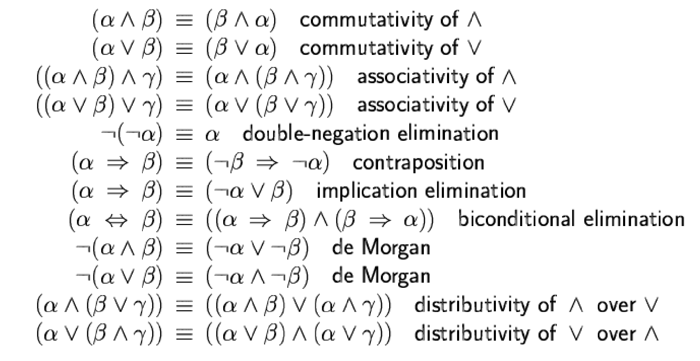
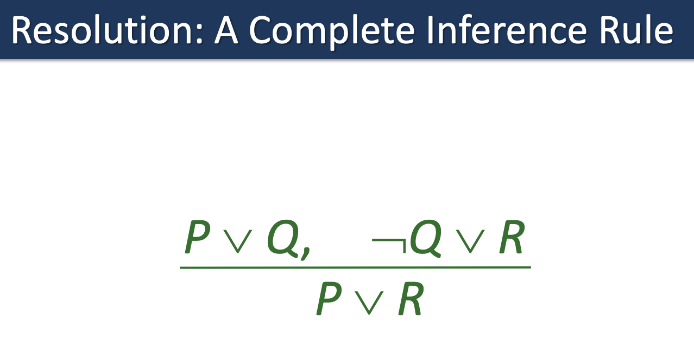
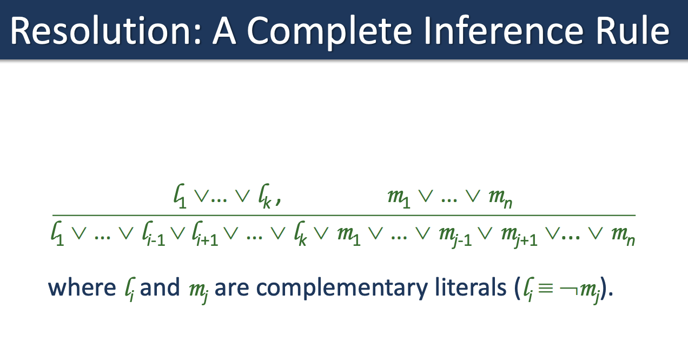
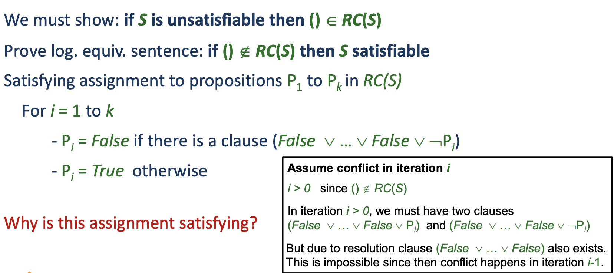

So we want to translate the arbitrary sencentences to CNF:

In order to convert to different sentences we have the following table to help us:

# Resolution
This is not only correct but is also a complete rule:

Since Q is either true or false then either the $P$ or $R$ has to be true.

## Proof of ground resolution theorem
