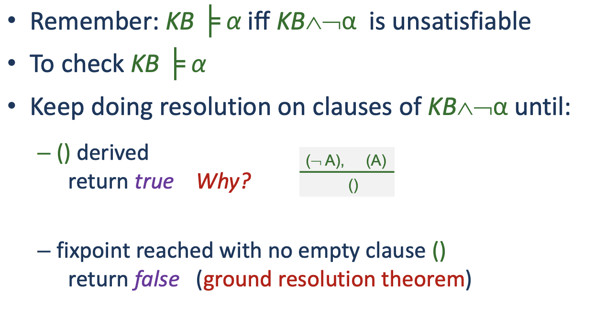
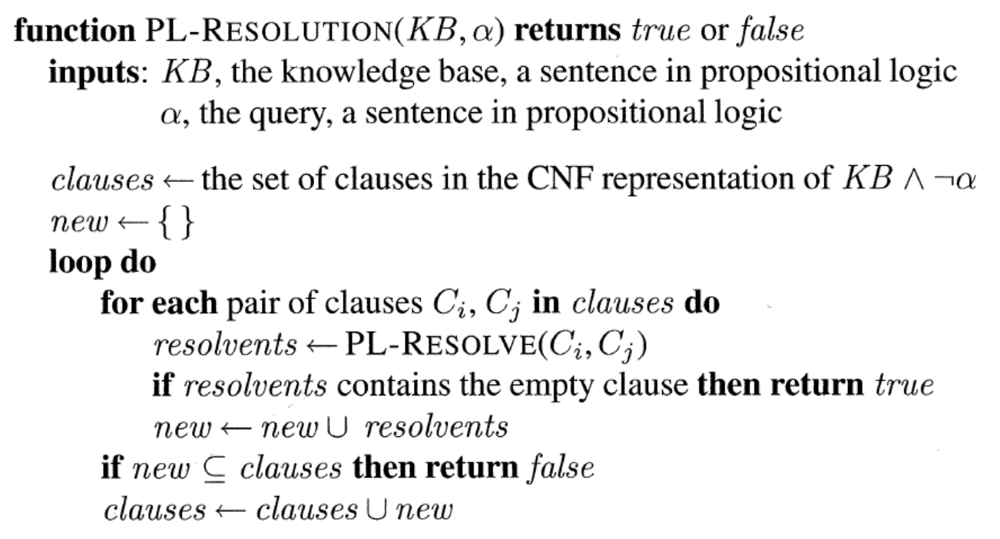
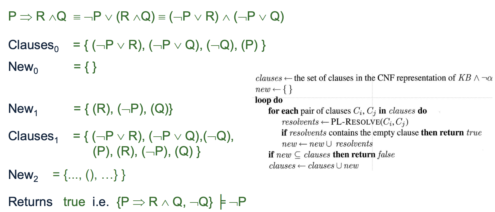
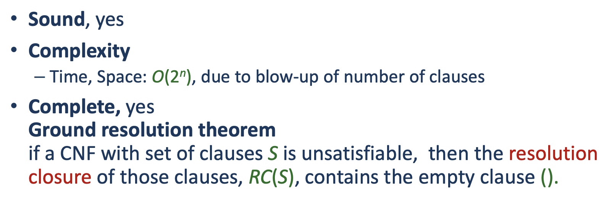

It is only possible because we get to derive that the symbol and the symbol negated cannot be true in any instance. Therefor it is $()$.

# Algorithm
This is the algorithm of [[algorithms.logic.propositionalLogic.plResolution]]

## Example

So in other terms it takes every clause. Tries to rule the opposites off, and then give until the clause reaches the *empty clause*.

## Properties 
