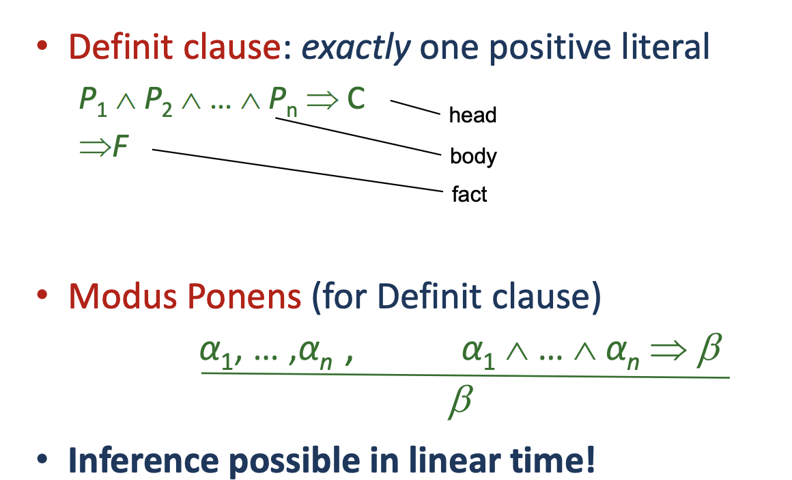

Definit clauses is when there are no negative literals. 

In order to see if there is only one positive literal you need to apply the implication elimination like the following:

So the head stays as is. And the implication and conjunctions is converted to disjunctions. Then every symbol in the body will be negated. Then you should see in the bottom if there is a positive literal(as seen in the picture the a is the only positive literal).