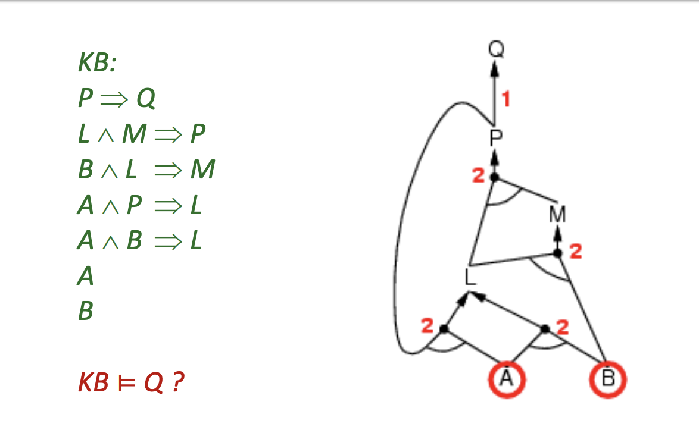
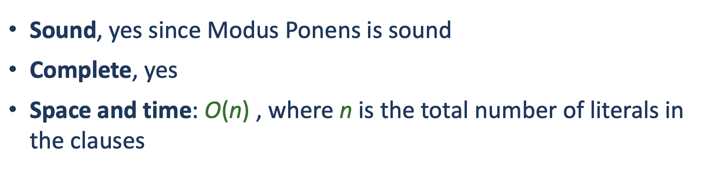

Forward chaining goes through our knowledge base in order to determine if it entails the new clause. 

You can only use forward chaining on clauses that are definite clauses(We have notes about what a definite clause is. Look for them). 

## Algorithm for Forward chaining
[[algorithms.logic.propositionalLogic.plFCEntails]]

This is a graph of the knowledge base. 

## Properties

