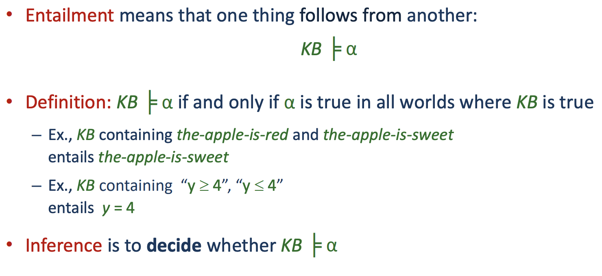

The symbol that is introduced here means "implies". In other words it stands for "entails".

**Inference** is to decide whether *KB* entails $a$. So it is the process of finding out if entailsment exists. So it is the algorithm to give an answer or to find out if that an entailment exist.
