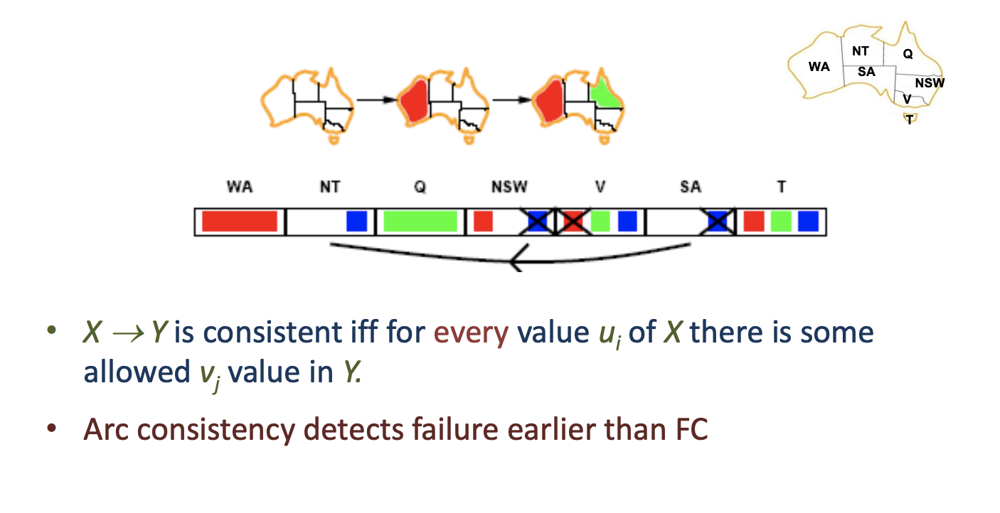

This algorithm uses a depth first search approach.
The algorithm is the following:

All version that we cover regarding CSPs is some type of version of the backtracking algorithm.

## Example

## Select-Unassigned-variable function

## Order-Domain-Values

# Forward Checking

If we had done arc consistency between NT and SA then we would have realized that there is a constraint between those two.

#### Algorithm of forward checking

# Maintaining Arc consistency (MAC)

#### MAC Algorithm
