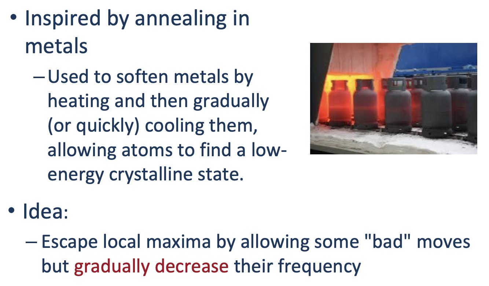

# Algorithm
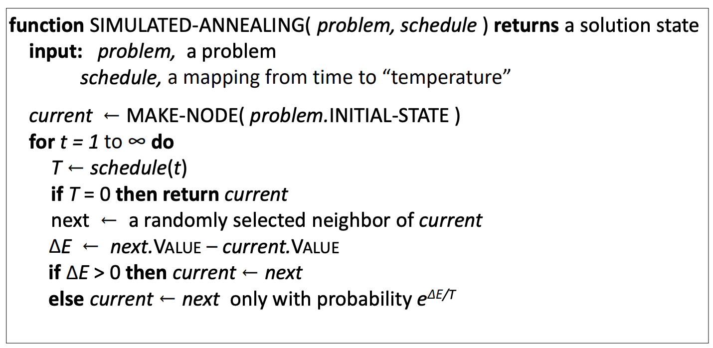

Simulated Annealing is trying to take in possibly bad states in at the beginning because of $T$ controlled by the function *schedule(t)*. If the next value is better than the current as seen at the third last and second last line, it then assigns next to the current variable. If *next* is not the best then it by the probability of $e^{\triangle E /T}$ it assigns current with the maybe worse solution. 

# Example
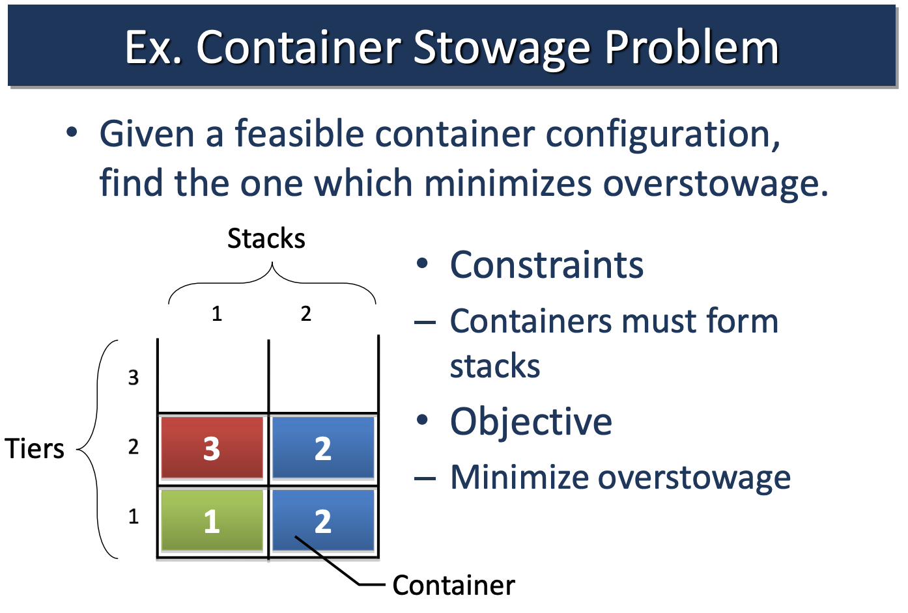

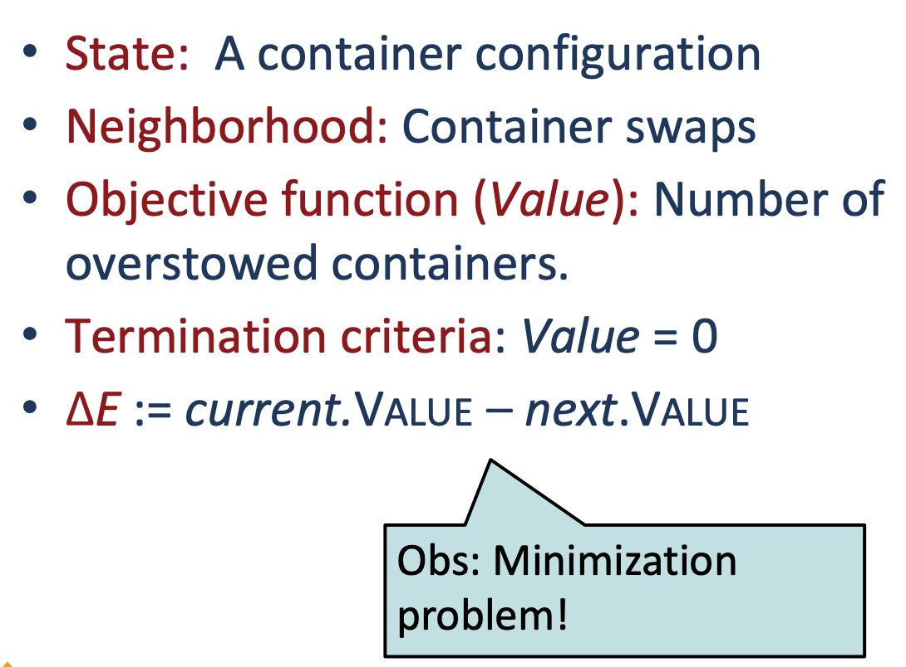

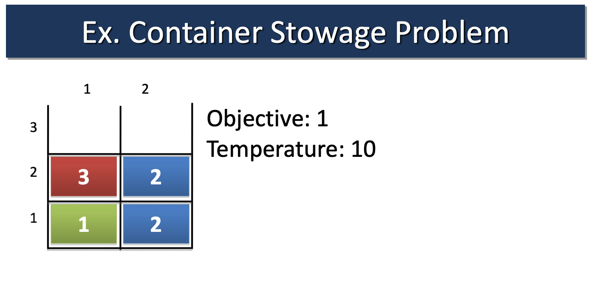

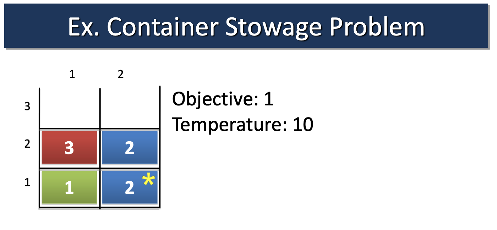

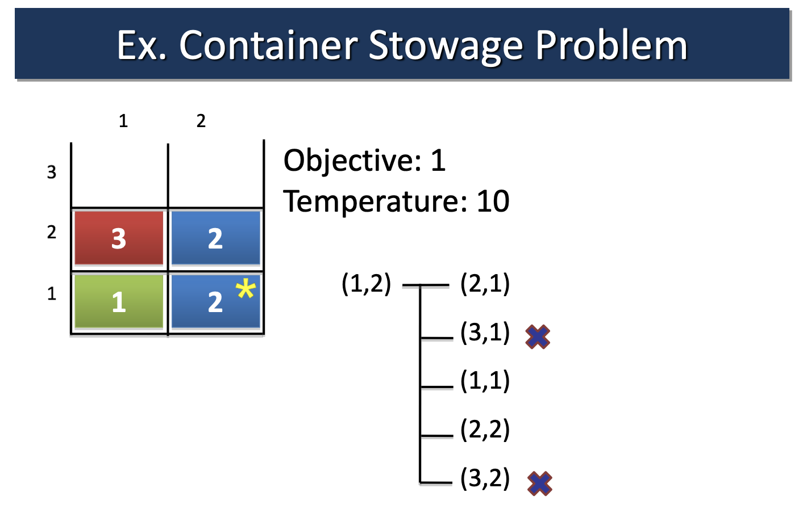

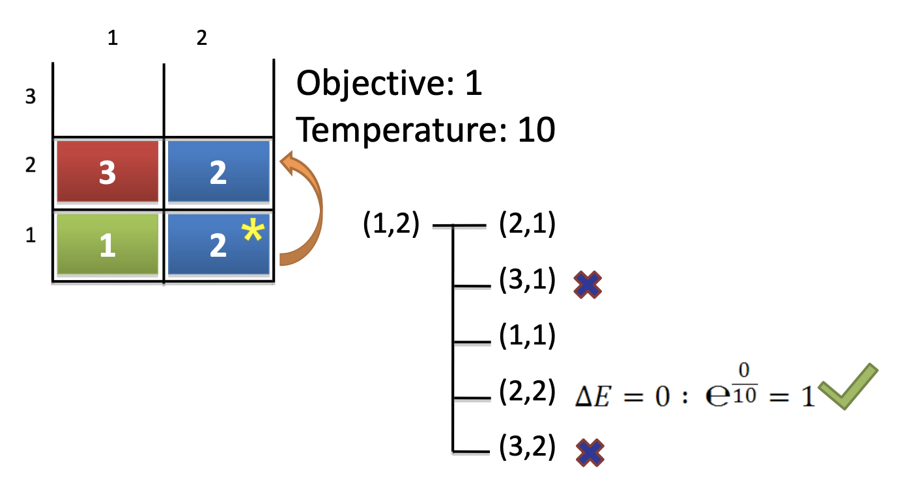

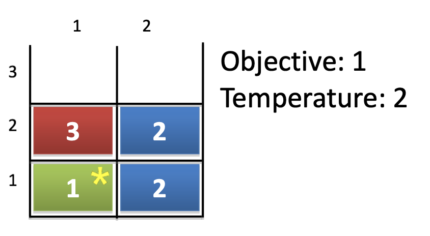

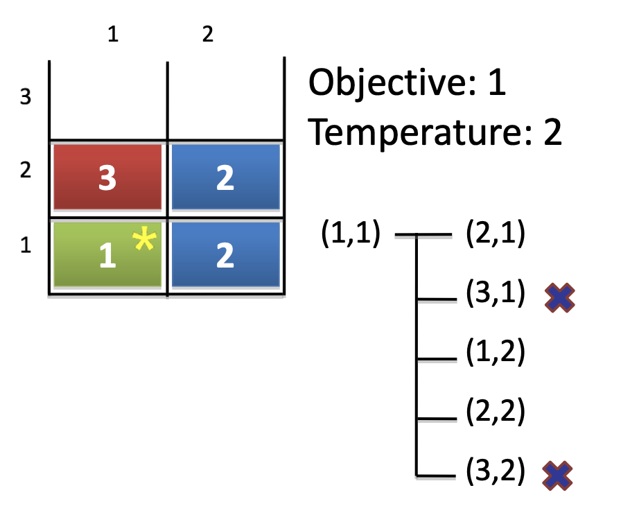

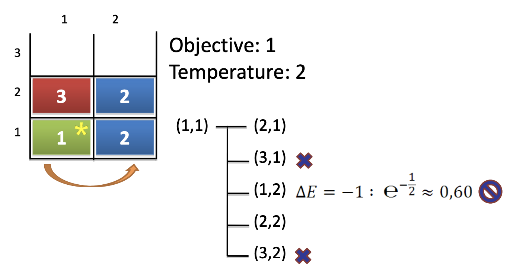

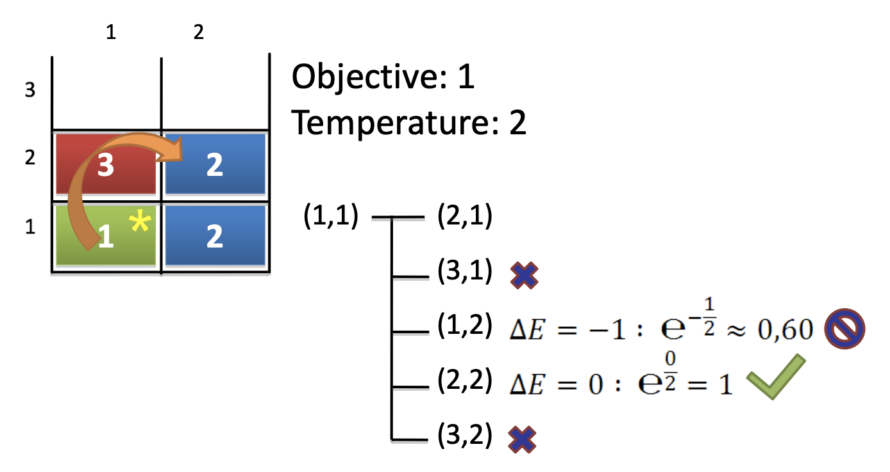

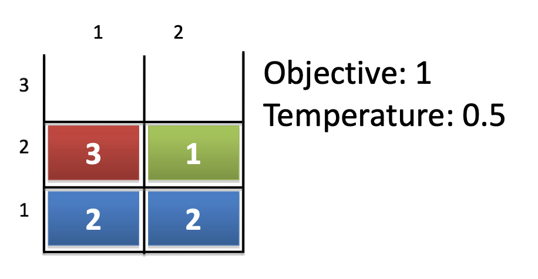

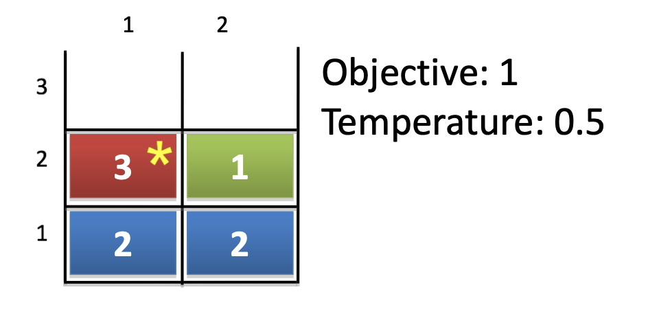

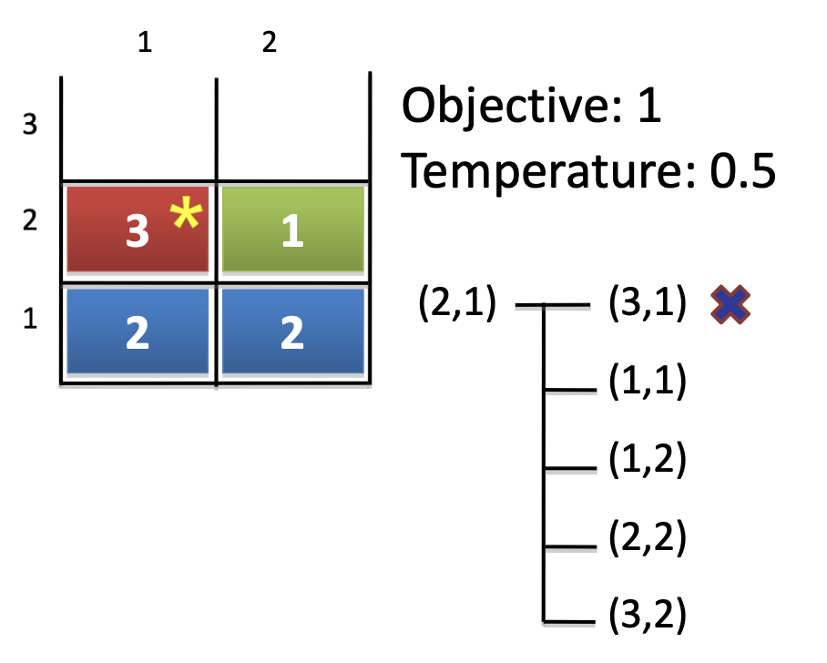

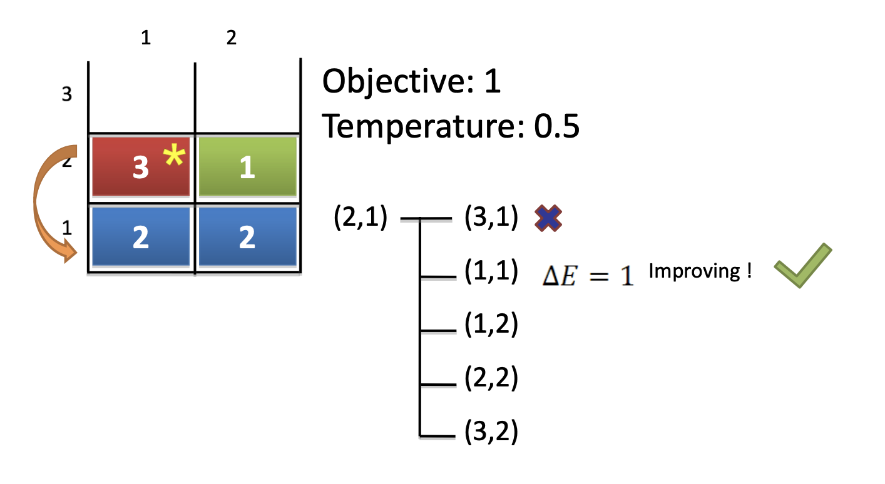

